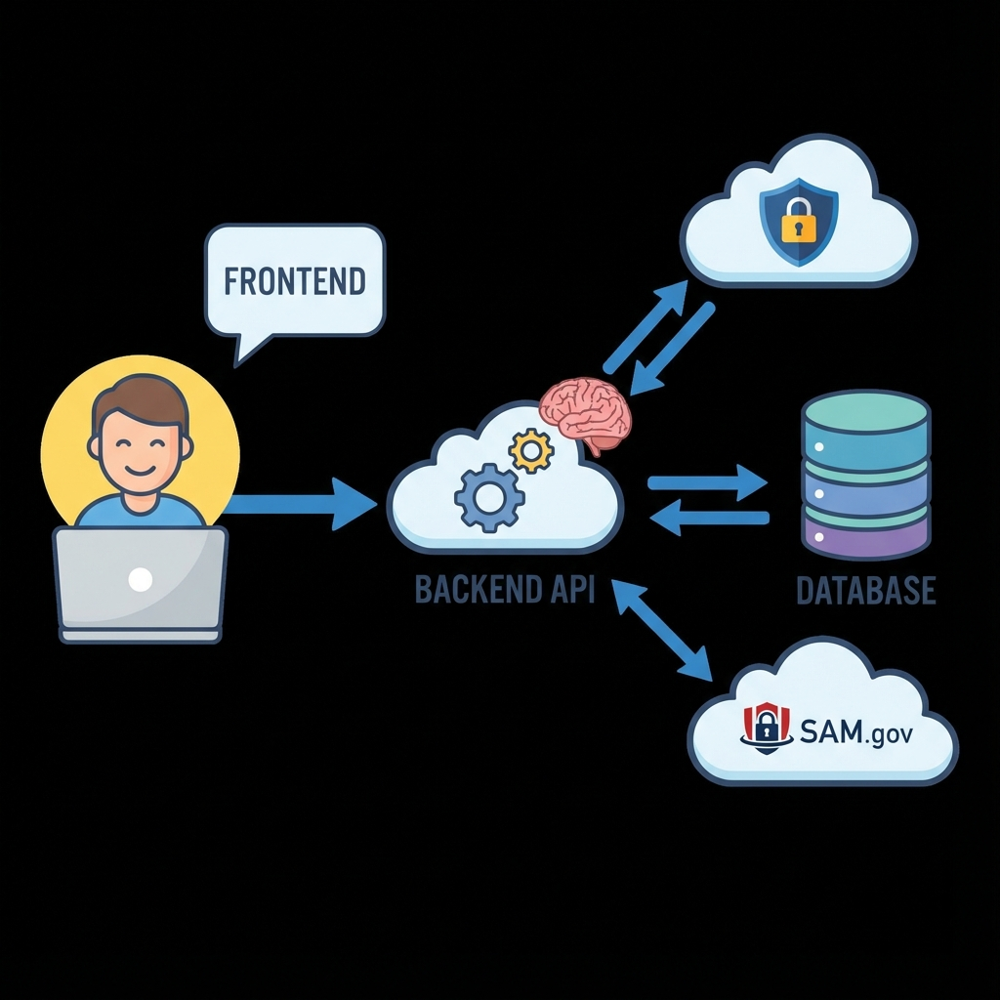

# 🏰 MyAIAgent: Architecture Guide (Beginner Friendly)

Welcome! This document explains how **MyAIAgent** works in simple terms. Think of this application like a **Restaurant**.

---

## 🍽️ The Restaurant Analogy

### 1. The Menu (Frontend) 💻
*   **What is it?**: This is what you see (the website).
*   **Technology**: **React** (like a dynamic, digital menu).
*   **Analogy**: Just like a menu helps you choose your food, the **Frontend** helps you choose what you want to do (view opportunities, match contracts, etc.). It looks pretty and sends your order to the kitchen.

### 2. The Waiter (API) 🤵
*   **What is it?**: The messenger between you and the kitchen.
*   **Technology**: **Node.js & Express**.
*   **Analogy**: When you click a button (place an order), the **API** (Waiter) runs to the kitchen to tell the chefs what you want. It brings the food (data) back to your table when it's ready.

### 3. The Kitchen (Backend) 👨‍🍳
*   **What is it?**: Where the actual work happens.
*   **Technology**: **Node.js**.
*   **Analogy**: The chefs cook the food. In our app, the "Chefs" are:
    *   **Cron Job Chef**: Wakes up every midnight to check SAM.gov for new ingredients (contracts).
    *   **AI Chef**: Looks at the contracts and decides if they are a "good match" for your taste (capabilities).

### 4. The Pantry (Database) 🥫
*   **What is it?**: Where we store all the ingredients and recipes.
*   **Technology**: **PostgreSQL**.
*   **Analogy**: The kitchen needs a place to keep the food fresh. We store user info, saved contracts, and matched opportunities here so they don't get lost.

### 5. The Grocery Store (External APIs) 🚛
*   **What is it?**: Where we buy fresh ingredients from outside.
*   **Sources**: **SAM.gov** (Government Contracts) & **OpenAI/Gemini** (Smart Brains).
*   **Analogy**: Our kitchen runs out of ingredients (contracts), so we send a truck (Cron Job) to the big Grocery Store (SAM.gov) to buy more.

---

## 🚀 How Data Flows (The Story)

1.  **Midnight Shopping**: While you sleep, our **Backfill Service** visits SAM.gov and downloads all the new contracts from the last week.
2.  **Stocking the Pantry**: We save these contracts in our **Database**.
3.  **Taste Testing (AI)**: Our **AI** looks at each contract. "Is this good for this company?" If yes, it gives it a high score (Match Score).
4.  **Serving You**: When you log in (Frontend), the Waiter (API) grabs the best matches from the Pantry (Database) and shows them on your Dashboard.

---

## 📂 Project Folder Map

*   `frontend/`: **The Dining Room**. All the code for the website (`.jsx` files).
*   `backend/`: **The Kitchen**. All the server logic (`.js` files).
    *   `src/services/cronService.js`: The alarm clock for the midnight shopping run.
    *   `src/services/samGovSync.js`: The shopping list logic (what to fetch).
    *   `src/routes/`: The waiter's path (URL endpoints).

---

## 🛡️ Security (The Vault)
We keep your secrets (API Keys, Passwords) locked in a safe called `api_secrets` inside the Database. Only the Head Chef (System) has the key to open it.
