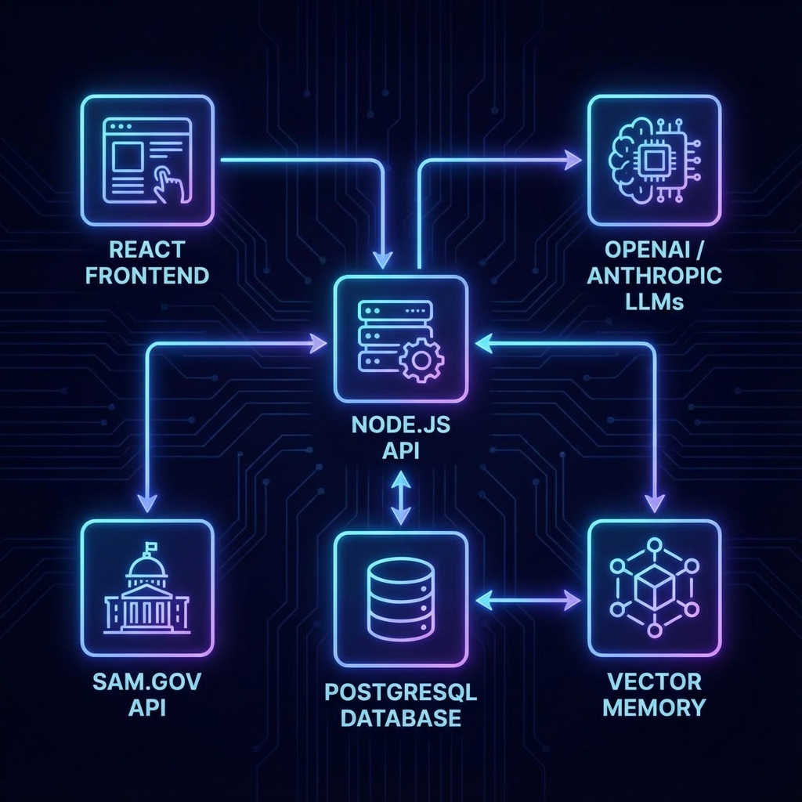
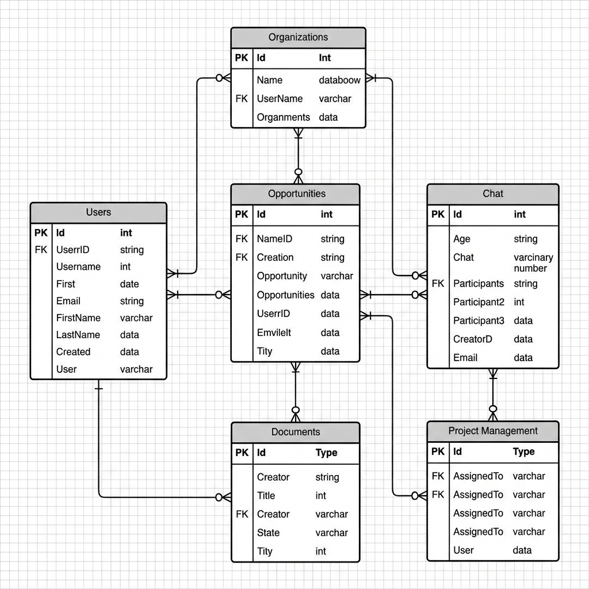
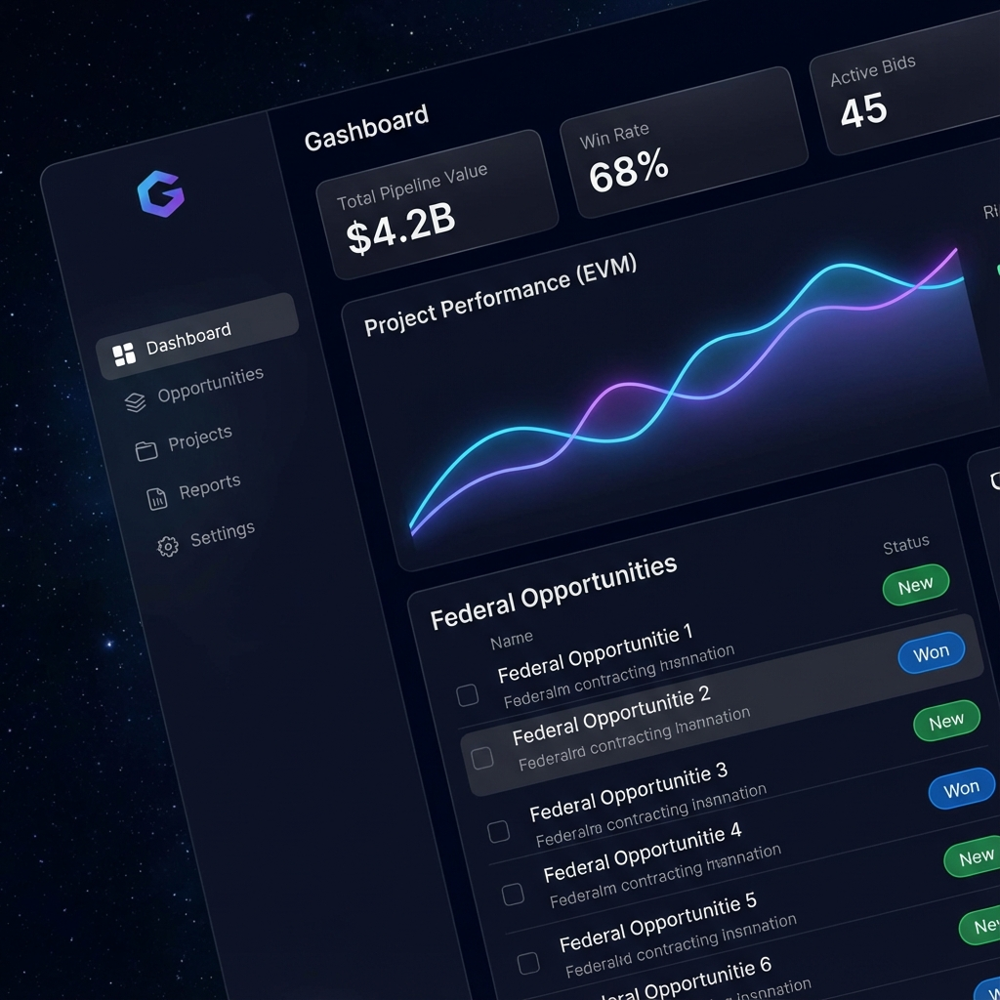

# My AI Agent - Data Model Reference

**Version 2.0** | **Database Engine:** PostgreSQL 15+

This document serves as the implementation reference for the **My AI Agent** database schema. It details the table structures, relationships, and data types used to power the platform's Auth, AI, GovTech, and EVM capabilities.

---

## 1. System Overview

### 1.1 Architecture
The data model supports a modern event-driven architecture linking React, Node.js, and PostgreSQL.

### 1.2 Domain Diagram (ERD)
The schema is partitioned into 6 logical domains.

---

## 2. Table Reference

### 2.1 Identity & Access Control

#### `users`
The central identity entity.
| Column | Type | Default | Description |
| :--- | :--- | :--- | :--- |
| `id` | `SERIAL PK` | | Unique User ID |
| `email` | `VARCHAR` | | Unique email address |
| `password_hash` | `VARCHAR` | | Bcrypt password hash |
| `full_name` | `VARCHAR` | | Display name |
| `role` | `VARCHAR` | `'user'` | Global role (`admin`, `user`, `moderator`) |
| `settings` | `JSONB` | `{}` | UI/Notification preferences |
| `created_at` | `TIMESTAMP` | `NOW()` | Registration timestamp |

#### `organizations` (Multi-Tenancy)
Tenants that own data.
| Column | Type | Default | Description |
| :--- | :--- | :--- | :--- |
| `id` | `SERIAL PK` | | Unique Org ID |
| `name` | `VARCHAR` | | Organization Name |
| `slug` | `VARCHAR` | | Unique URL-friendly slug |
| `owner_id` | `INT FK` | | Reference to `users.id` (Creator) |
| `is_active` | `BOOLEAN` | `TRUE` | Subscription status |
| `address` | `TEXT` | | Physical address |
| `phone` | `VARCHAR` | | Contact info |

#### `organization_users` (Members)
Junction table for User-Organization membership.
| Column | Type | Default | Description |
| :--- | :--- | :--- | :--- |
| `organization_id` | `INT FK` | | Ref `organizations.id` |
| `user_id` | `INT FK` | | Ref `users.id` |
| `role` | `VARCHAR` | `'member'` | Org Role (`owner`, `admin`, `member`) |

#### `api_secrets`
Encrypted storage for external API keys.
| Column | Type | Default | Description |
| :--- | :--- | :--- | :--- |
| `id` | `SERIAL PK` | | Secret ID |
| `key_name` | `VARCHAR` | | Internal reference name |
| `key_value` | `TEXT` | | **Encrypted** API Key string |
| `service_name` | `VARCHAR` | | e.g., 'openai', 'anthropic' |
| `organization_id` | `INT FK` | | Scope to Organization (Optional) |

---

### 2.2 Core AI & Chat

#### `conversations`
A chat session context.
| Column | Type | Default | Description |
| :--- | :--- | :--- | :--- |
| `id` | `SERIAL PK` | | Conversation ID |
| `user_id` | `INT FK` | | Owner |
| `organization_id` | `INT FK` | | Data scope |
| `title` | `VARCHAR` | | Auto-generated or user title |
| `model` | `VARCHAR` | | e.g. `gpt-4o` |
| `system_prompt` | `TEXT` | | Custom instructions for this chat |
| `is_archived` | `BOOLEAN` | `FALSE` | Soft delete flag |

#### `messages`
The atomic units of conversation.
| Column | Type | Default | Description |
| :--- | :--- | :--- | :--- |
| `id` | `SERIAL PK` | | Message ID |
| `conversation_id` | `INT FK` | | Parent conversation |
| `role` | `VARCHAR` | | `user`, `assistant`, or `system` |
| `content` | `TEXT` | | Markdown text content |
| `attachments` | `JSONB` | `[]` | Light metadata for files |
| `function_calls` | `JSONB` | `{}` | Tool usage logs |

#### `memory_facts` (The "Brain")
Long-term semantic memory.
| Column | Type | Default | Description |
| :--- | :--- | :--- | :--- |
| `id` | `SERIAL PK` | | Fact ID |
| `user_id` | `INT FK` | | Owner |
| `fact_text` | `TEXT` | | Extracted knowledge (e.g., "User is a Project Manager") |
| `relevance_score` | `DECIMAL` | `0.5` | Importance weight |
| `source_message_id` | `INT FK` | | Provenance link |

---

### 2.3 User Agents

#### `user_ai_agents`
Custom agents defined by users.
| Column | Type | Default | Description |
| :--- | :--- | :--- | :--- |
| `id` | `SERIAL PK` | | Agent ID |
| `user_id` | `INT FK` | | Owner |
| `agent_name` | `VARCHAR` | | e.g., "Review Bot" |
| `provider_name` | `VARCHAR` | | `openai`, `anthropic`, `google` |
| `config` | `JSONB` | | Temperature, TopP, etc. |

---

### 2.4 Federal Opportunities (GovTech)

#### `opportunities` (Internal Pipeline)
Active bids being worked on.
| Column | Type | Default | Description |
| :--- | :--- | :--- | :--- |
| `id` | `SERIAL PK` | | Internal Opportunity ID |
| `notice_id` | `VARCHAR` | | Link to SAM.gov ID |
| `internal_status` | `VARCHAR` | `'New'` | `New`, `In Progress`, `Submitted`, `Won` |
| `internal_score` | `INT` | | 0-100 PWin Score |
| `assigned_to` | `INT FK` | | User responsible |

#### `samgov_opportunities_cache` (Data Lake)
Raw data synced from SAM.gov API.
| Column | Type | Default | Description |
| :--- | :--- | :--- | :--- |
| `id` | `SERIAL PK` | | Cache ID |
| `notice_id` | `VARCHAR` | | Unique SAM.gov UUID |
| `solicitation_number`| `VARCHAR` | | Official Sol# |
| `raw_data` | `JSONB` | | Full JSON payload from SAM API |
| `naics_code` | `VARCHAR` | | Industry classification |
| `response_deadline` | `TIMESTAMP`| | Due date |

### 2.5 Market Intelligence

#### `fpds_contract_awards`
Historical spending data.
| Column | Type | Default | Description |
| :--- | :--- | :--- | :--- |
| `id` | `UUID PK` | | Award ID |
| `piid` | `VARCHAR` | | Procurement Instrument ID |
| `vendor_name` | `VARCHAR` | | Winner name |
| `current_contract_value`| `DECIMAL`| | $ Amount |
| `contracting_agency_name`| `VARCHAR`| | Client |

#### `competitive_intelligence`
AI-generated strategic analysis.
| Column | Type | Default | Description |
| :--- | :--- | :--- | :--- |
| `opportunity_id` | `INT FK` | | Target Opp |
| `incumbent_vendor_name`| `VARCHAR`| | Identified incumbent |
| `win_probability` | `DECIMAL` | | 0.0 - 1.0 calculated probability |
| `ai_analysis` | `TEXT` | | Strategic memo generated by LLM |

---

### 2.6 Project Management (EVM)

#### `evm_projects`
Projects for won contracts.
| Column | Type | Default | Description |
| :--- | :--- | :--- | :--- |
| `id` | `UUID PK` | | Project ID |
| `contract_award_id` | `UUID FK` | | Link to FPDS Award |
| `budget_at_completion`| `DECIMAL` | | Total Budget (BAC) |
| `planned_start_date` | `DATE` | | Schedule Start |

#### `evm_reporting_periods`
Performance snapshots.
| Column | Type | Default | Description |
| :--- | :--- | :--- | :--- |
| `project_id` | `UUID FK` | | Parent Project |
| `cost_performance_index`| `DECIMAL` | | CPI (Efficiency) |
| `schedule_performance_index`| `DECIMAL` | | SPI (Schedule) |
| `earned_value` | `DECIMAL` | | EV ($) |
| `actual_cost` | `DECIMAL` | | AC ($) |

---

## 3. Performance & Usage

#### `usage_tracking`
Billing and quota metering.
| Column | Type | Default | Description |
| :--- | :--- | :--- | :--- |
| `user_id` | `INT FK` | | Target User |
| `date` | `DATE` | | Daily bucket |
| `tokens_consumed` | `INT` | | LLM usage |
| `voice_minutes_used` | `FLOAT` | | Audio usage |

---

## 4. Key Indexes

*   **Full Text Search**: Using `tsvector` on `messages.content`.
*   **JSONB Indexing**: GIN indexes on `samgov_opportunities_cache.raw_data` for deep querying.
*   **Geospatial**: Ready for `PostGIS` expansion for `place_of_performance` (future).
